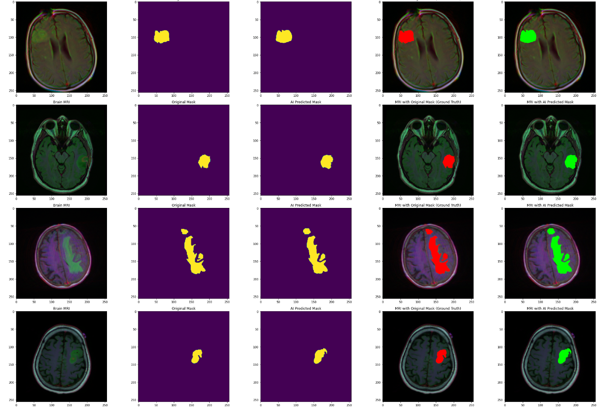

# ML for Tumor Detection

This is a project to train AI/ML model to classify and locate the tumor from the MRI picture.  
For classify purpose, ResNet model will be used.   
For location purpose, ResUNET model will be used.  

